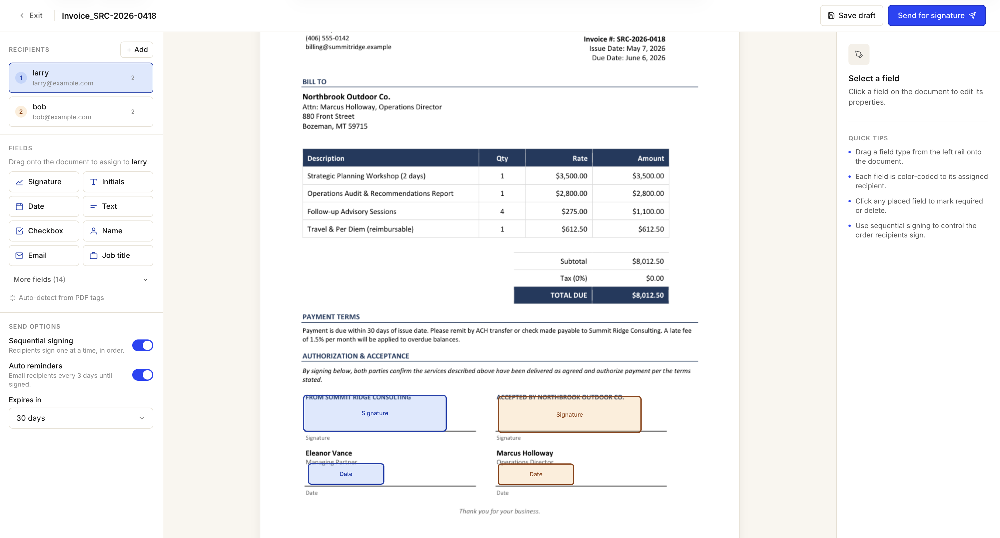
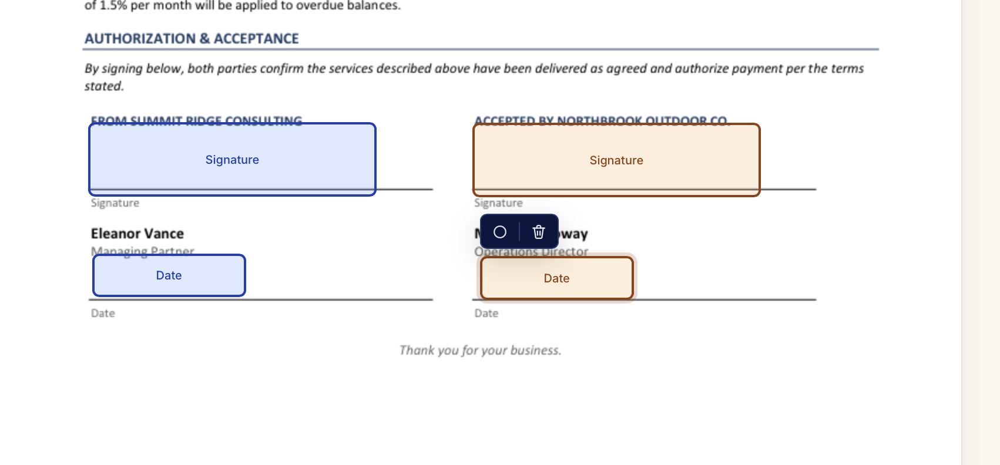

<p align="center">
  
</p>

<p align="center">
  
</p>

<p align="center">
  
  
  
  
</p>

<p align="center">
  <strong>Self-hosted e-signature platform with a cryptographic audit ridge.</strong><br/>
  Drop it on your own infrastructure. Sign documents, seal them, verify them — without ever sending data to a SaaS.<br/><br/>
  <a href="#quick-start">Quick Start</a> · <a href="#features">Features</a> · <a href="#audit-chain--seal-verification">Audit Chain</a> · <a href="SECURITY.md">Security</a>
</p>

<p align="center">
  
</p>

---

## Why

Most e-signature platforms are SaaS — they're expensive, opaque, and store every document you've ever signed on infrastructure you don't control. For organizations that handle FERPA / HIPAA / GDPR-adjacent paperwork, that's a real problem; for individuals, it's a quiet one.

DocuRidge is what you get if you decide the e-signature stack should live next to everything else you self-host: same Docker network, same backups, same threat model. A **ridge** is a tamper-evident chain — every state-changing event hashed, signed with an org-scoped Ed25519 key, and chained by `prev_hash`. The sealed PDF embeds the manifest as a PDF attachment, the audit log as a human-readable final page, and the cryptographic chain head in the document hash. One command (`npm run verify <pdf>`) re-walks the ridge and tells you whether anything has been touched since the seal.

---

## How It Works

```
Upload PDFs --> Place Fields --> Send Envelope --> Recipient Signs --> Seal & Verify
```

1. **Sender uploads** one or more PDFs. Size + MIME validated, SHA-256 hash recorded, virus-scan extension point documented.
2. **Drag-and-drop fields** onto each page: signature, initials, date, text, number, checkbox, radio, dropdown, name, email, phone, address, company, formula, attachment, approve / decline, note, line, stamp, drawing. Multi-select toolbar, per-recipient assignee chip, per-field conditional logic.
3. **Add recipients** with sequential or parallel routing. New roles supported: APPROVER, WITNESS, IN_PERSON_SIGNER. Conditional routing skips a recipient unless an earlier field has the trigger value.
4. **Send the envelope.** Each recipient gets a single-use, time-bounded JWS signing link bound to their email + the envelope.
5. **Recipient signs** at their unique URL — UETA/ESIGN-aware consent, in-browser PDF preview, multi-font typed signatures (Caveat, Dancing Script, Great Vibes, Sacramento), drawn signatures with quadratic-curve smoothing, drawing fields for freeform marks.
6. **Audit events fire** at every step — `envelope.sent`, `recipient.viewed`, `recipient.signed`, `envelope.completed`. Each is hashed, Ed25519-signed, and chained.
7. **Final seal**: signatures stamped onto the PDF, audit page appended, signed JSON manifest embedded as a PDF attachment, document hash recorded in the chain head.
8. **Verify any time**: `docker compose -p docuridge exec app npm run verify <sealed.pdf>` re-walks the chain, recomputes the document hash, verifies every Ed25519 signature, exits non-zero on any tamper.

---

## Features

### Documents & Fields
- **PDF upload pipeline**: size + MIME validated, multi-document envelopes, in-browser preview with page navigation, anchor-tag autoplacement (embed `{{sig:1}}` / `{{date:2}}` markers in your PDF, click "Auto-detect" to populate fields)
- **23 field types**: signature, initials, date, text, number, checkbox, radio, dropdown, name, email, job title, phone, address, company, formula (recursive-descent expression parser with 18 unit tests), attachment, approve, decline, note, line, stamp, drawing
- **Per-field properties** via JSON meta: read-only, char limit, regex pattern, min/max for numbers, options for select fields, formula expression, conditional show-if rule, recipient-uploaded attachment, sender-uploaded stamp image
- **Multi-select contextual toolbar**: select multiple fields with shift-click, change required state / recipient / size in bulk
- **Per-field assignee chip**: tiny pill on each placed field opens a portalled menu to reassign without touching the right rail
- **Conditional logic**: any field can be hidden until a source field has a chosen value; the source picker adapts to the source type (CHECKBOX → checked/unchecked, DROPDOWN/RADIO → option select, everything else → exact match)

### Recipients & Routing
- **Sequential or parallel** routing (default sequential)
- **Six roles**: SIGNER, APPROVER, CC, VIEWER, WITNESS, IN_PERSON_SIGNER
- **Conditional routing**: skip a recipient unless an earlier field has the trigger value — recorded in the audit chain as `signing_status=SKIPPED`
- **Reassign-by-recipient**: a recipient who was sent the envelope by mistake can forward it to the right person (audit-recorded, generates a fresh JWS-signed token for the new email)
- **Decline with reason**, **finish-later drafts** persisted client-side and resumed when they return

### Signing Ceremony
- **UETA / ESIGN-aware consent**: explicit disclosure, version-tagged in the audit chain
- **Multi-font typed signatures**: four cursive fonts (Caveat, Dancing Script, Great Vibes, Sacramento), live preview, font choice persisted on the Signature row
- **Drawn signatures**: pointer-event canvas with quadratic-curve smoothing and coalesced events for sub-frame stroke fidelity, trimmed PNG export
- **DRAWING field**: freeform mark capture for diagrams, freehand notation, anything beyond a signature
- **Saved defaults**: a recipient can save their drawn signature + initials and apply-to-all on subsequent envelopes
- **Comments thread**: back-channel between sender and recipient, scoped to the envelope

### Templates & Bulk
- **Reusable templates**: save any envelope's structure (documents + fields + recipient roles) as a template, instantiate with role → email mapping
- **PowerForms**: public template links that mint a fresh envelope per submission (anonymous senders, optional)
- **Bulk send**: upload a CSV against a chosen template, one envelope per row, allowlist gate still applies, status dashboard surfaces per-row errors

### Cryptographic Audit Chain
- **Every state-change** is an `AuditEvent` row — `envelope.sent`, `recipient.signed`, `email.failed`, `envelope.voided`, etc. — with `{prev_hash, event_data, actor, ip, user_agent, timestamp, signature}`
- **Org-scoped Ed25519 key** generated on first boot, persisted to a dedicated volume, file permissions locked, never logged, never API-exposed
- **Chain signing**: each event's hash signed with `@noble/ed25519`, chain head recorded on the SealedDocument
- **Sealed PDF output**: signatures stamped, human-readable audit page appended (with full recipient + field history), signed JSON manifest embedded as a PDF attachment, document hash bound into the chain
- **Verify command**: `npm run verify <sealed.pdf>` — exits non-zero on any tamper. Tested against PDF tamper, audit event tamper, chain truncation, signature forgery

### Operator Surface
- **Mail abstraction**: two backends (`mailhog` for dev, `smtp_relay` for production)
- **Code-level recipient allowlist** with its own unit tests (10 tests covering case, whitespace, subdomain spoofing, local-part spoofing, edge-case input). Configured via `MAIL_ALLOWLIST` env var
- **Brand colour customisation**: hex picker drives email button colour and the signing-page header accent
- **Email logo upload**: per-org logo (PNG / JPEG / WebP, ≤200KB) appears at the top of every notification email
- **Custom email footers**, **default field font** (sans / serif / mono — drives the standard pdf-lib font used on sealed PDFs)
- **Folders**: nested envelope organization
- **Bulk dashboard actions**: void / delete-drafts on multiple envelopes from the list view
- **Webhooks**: HMAC-SHA256-signed POST to your URL on every audit event (`X-DocuRidge-Signature: sha256=<hex>`)
- **Forward-completed**: send a signed PDF view-link to additional recipients after completion, with a per-link expiration
- **"Clear all" notifications**: per-user `notificationsClearedAt` cursor — the audit chain stays untouched, the bell just hides events older than the cursor

### Auth & Authorisation
- **Email + password**: Argon2id, email verification, password reset, account lockout after N failed attempts
- **Server-side sessions** via httpOnly cookies, CSRF protection on every server action
- **Org-scoped multi-tenancy** with `ADMIN` / `SENDER` / `VIEWER` roles
- **Centralised `can(user, action, resource)`**: the only authorisation surface in the app — every endpoint, every action, every resource passes through it
- **Strategy-swap auth**: SSO (SAML / OIDC / CAS / Shibboleth) is plug-in work, not a rewrite — the auth layer is designed for the swap
- **Rate limiting** on `/login`, `/register`, `/password-reset`, signing-token endpoints — in-process token bucket, documented upgrade path to Redis

### Accessibility & Polish
- **WCAG 2.1 AA verified**, axe-core run in Playwright
- **Keyboard navigation** works for every flow including the signing ceremony
- **Mobile signing** tested at 390px (iPhone SE width)
- **ESC closes** every modal; focus management correct on route changes
- **Loading / error / empty states** explicit for every primary view

---

## See It In Action

**Full walkthrough on YouTube** — the entire flow: builder, multi-recipient routing, signing ceremony, sealed PDF, audit verification.

<p align="center">
  <a href="https://youtu.be/j0gYGRn2nuU">
    
  </a>
  <br/>
  <sub><a href="https://youtu.be/j0gYGRn2nuU">▶ Watch on YouTube</a></sub>
</p>

Quick clip of the signing ceremony if you just want a 30-second taste:

<p align="center">
  <video src="https://github.com/umzcio/DocuRidge/raw/main/docs/media/signature-flow.mp4" controls width="900" muted></video>
</p>

> If your markdown viewer doesn't render the inline player, the file is at <a href="docs/media/signature-flow.mp4">docs/media/signature-flow.mp4</a> (also a release asset on <a href="https://github.com/umzcio/DocuRidge/releases/tag/v1.0.0">v1.0.0</a>).

Each placed field carries the recipient's color so the document tells you at a glance who needs to sign what. The contextual toolbar appears on multi-select for bulk required-toggle, reassign, or delete:

<p align="center">
  
</p>

---

## Tech Stack

| Layer | Technology |
|-------|-----------|
| **Frontend** | Next.js 15 App Router · TypeScript strict · Tailwind · Server Components + Server Actions |
| **PDF** | pdf-lib (stamping + sealing) · pdfjs-dist (in-browser preview + anchor-tag scanning) |
| **Database** | PostgreSQL 16 · Prisma (versioned migrations, no `db push`) |
| **Auth** | Argon2id (password hashing) · jose (JWS signing tokens) · server-side sessions |
| **Crypto** | @noble/ed25519 (audit chain signing) · org-scoped key generated on first boot |
| **Mail** | nodemailer · two transports (MailHog / SMTP relay) · code-level allowlist gate |
| **Logging** | Pino (JSON) · per-request ID · user / action / resource fields |
| **Validation** | Zod everywhere — every request parsed and validated before it touches business logic |
| **Tests** | Vitest (unit + integration) · Playwright (e2e + a11y + smoke) |
| **Deployment** | Docker Compose · stack-isolated to `docuridge_*` containers / networks / volumes |

---

## Architecture

```
                        +------------------+
                        |    Browser       |
                        |  Next.js 15 RSC  |
                        +--------+---------+
                                 |  HTTPS at /DocuRidge
                        +--------+---------+
                        |  Reverse Proxy   |
                        |  (your nginx /   |
                        |   Caddy / etc.)  |
                        +--------+---------+
                                 |
                  +--------------+--------------+
                  |                             |
         +--------+---------+         +--------+---------+
         | docuridge_app    |         | docuridge_       |
         | Next.js + Prisma |         |   mailhog        |
         +--------+---------+         +--------+---------+
                  |                             |
         +--------+---------+         +--------+---------+
         | docuridge_       |         | external SMTP    |
         |   postgres       |         |   relay          |
         | (FS-encrypted)   |         |                  |
         +-------------------+        +------------------+
                  |
         +--------+---------+
         | docuridge_data   |
         |   /uploads       |
         |   /sealed        |
         |   /attachments   |
         |   /keys          |
         +-------------------+
```

The reverse proxy is yours — DocuRidge ships an example nginx snippet and connects via a docker network so the app container is never exposed on a host port.

---

## Quick Start

**Prerequisites:**
- Docker & Docker Compose
- A reverse proxy (nginx, Caddy, Traefik) — or use the local-dev override that binds to `127.0.0.1:3737`

**Setup:**

```bash
# Clone
git clone https://github.com/umzcio/DocuRidge.git
cd DocuRidge

# Configure environment
cp .env.example .env
# Edit .env — DATABASE_URL, PUBLIC_URL, MAIL_BACKEND, BOOTSTRAP_*

# Launch the stack (all containers/networks/volumes scoped to "docuridge")
docker compose -p docuridge up --build -d

# Watch the entrypoint until it reports "Ready"
docker compose -p docuridge logs -f app

# Read the bootstrap token (auto-generated into .env on first boot)
grep '^BOOTSTRAP_TOKEN=' .env

# Visit /DocuRidge/setup with the token, choose an admin password, sign in.
```

### Local development without a reverse proxy

```bash
docker compose -p docuridge -f docker-compose.yml -f docker-compose.local.yml up --build -d
# now reachable at http://127.0.0.1:3737/DocuRidge
```

The override file binds the app to **`127.0.0.1:3737`** (loopback only, never `0.0.0.0`) and is **not** auto-loaded — production deploys stay isolated to the docker network.

### Tests

```bash
npm install
npm run test          # Vitest unit + integration
npm run test:e2e      # Playwright (requires the stack to be running)
```

---

## Audit Chain & Seal Verification

The chain is the heart of DocuRidge. Every audit event is a row:

```ts
{
  envelopeId: string,
  seq: number,                 // monotonic per-envelope
  prevHash: string,            // sha256 of the previous event in this envelope
  type: 'envelope.sent' | 'recipient.signed' | ...,
  data: { ... },               // canonical-JSON of the event payload
  actor: string,
  ipAddress: string,
  userAgent: string,
  timestamp: Date,
  eventHash: string,           // sha256 of (prevHash + canonical(data) + ...)
  signature: string,           // ed25519 signature of eventHash with the org key
}
```

The sealed PDF carries:
1. **Stamped fields** — signature images, typed cursive (rendered to PNG client-side so pdf-lib doesn't need custom font embedding), checkmarks (drawn as vector strokes because pdf-lib's standard fonts can't encode U+2713), date / text / formula values
2. **Human-readable audit page** appended at the end with the full event timeline
3. **Signed JSON manifest** embedded as a PDF attachment containing every event, the chain head hash, and the manifest's own ed25519 signature
4. **Document hash** bound into the chain so the sealed PDF is non-substitutable

Verify any sealed PDF:

```bash
docker compose -p docuridge exec app npm run verify -- /path/to/sealed.pdf
```

The verifier:
- Re-extracts the JSON manifest from the PDF attachment
- Verifies the manifest's own signature against the org key
- Re-walks every event and recomputes `eventHash` from `prevHash + data`
- Verifies each event's signature
- Recomputes the document SHA-256 and checks it against the chain
- Exits **non-zero** if anything fails

Tested against: PDF byte-tampering, audit-event field-tampering, chain truncation, signature forgery, manifest substitution.

---

## Project Structure

```
DocuRidge/
├── docker-compose.yml
├── docker-compose.local.yml          # 127.0.0.1 binding for dev
├── .env.example
├── deploy/
│   └── nginx/docuridge.conf          # example reverse-proxy snippet
├── prisma/
│   ├── schema.prisma                 # full data model
│   └── migrations/                   # versioned migrations (no db push)
├── src/
│   ├── app/
│   │   ├── (auth)/                   # login, register, password reset
│   │   ├── dashboard/                # sender dashboard, envelopes, templates, settings
│   │   ├── sign/[token]/             # recipient signing ceremony
│   │   ├── form/[token]/             # PowerForms public route
│   │   ├── share/[token]/            # forward-completed view route
│   │   ├── setup/                    # one-time bootstrap
│   │   └── healthz, readyz/          # liveness + readiness probes
│   ├── components/                   # design-system primitives + dashboard chrome
│   ├── lib/
│   │   ├── audit/                    # event recording + chain signing
│   │   ├── auth/                     # session, passwords, can()
│   │   ├── crypto/                   # org-key generation + signing
│   │   ├── envelopes/                # lifecycle service (send / advance / void / complete)
│   │   ├── formula/                  # recursive-descent expression evaluator
│   │   ├── mail/                     # transport + allowlist
│   │   ├── pdf/                      # seal + anchor-tag scan + coords
│   │   └── webhooks/                 # HMAC-signed delivery
│   └── middleware.ts                 # request-ID, CSRF, trust-proxy
├── scripts/
│   ├── docker-entrypoint.sh          # bootstrap, migrate, start
│   └── verify.ts                     # the verify command
└── tests/
    ├── e2e/                          # Playwright
    └── unit/                         # Vitest
```

---

## Design Decisions

**Why bake basePath `/DocuRidge` in from day one?** Retrofitting it is brutal — every link, asset, fetch, redirect, and test breaks. Doing it from the first commit is essentially free, and it keeps subpath deployments first-class.

**Why store typed signatures as PNG instead of stamping cursive glyphs in pdf-lib?** Recipients pick from four cursive fonts (Caveat, Dancing Script, Great Vibes, Sacramento). Embedding all four as TrueType in pdf-lib would balloon the sealed PDF and require fontkit. Instead, the ceremony renders the chosen font to a high-res canvas, exports a trimmed PNG, and the seal pipeline embeds it like any other signature image. The sealed PDF stamps the actual cursive glyphs the recipient saw, with no custom font in the document.

**Why a code-level mail allowlist in addition to env config?** Defense in depth. The allowlist function (`isAllowedRecipient`) is called from the send pipeline whenever `MAIL_BACKEND=smtp_relay`. Refusal: log a structured warning, record an `EmailEvent` row, throw in non-production. A misconfigured env var alone cannot disable the safety net — removal is a code change documented in `SECURITY.md`.

**Why versioned Prisma migrations and not `prisma db push`?** Migrations are the schema change history. `db push` is a development convenience that makes the production migration runner unable to apply changes consistently. Every schema change here is a versioned migration that the entrypoint applies on startup.

**Why pdf-lib instead of a server-side headless browser?** pdf-lib operates on the actual PDF object graph — pages, fields, attachments, annotations. A headless browser would render to a new PDF and lose the ability to embed the signed JSON manifest as a proper PDF attachment that any standard PDF reader can extract.

**Why local Ed25519 instead of cloud KMS?** v1 is self-host-first. The org key is generated on first boot, persisted to a dedicated volume with `0600` permissions, and never logged. The cloud-KMS upgrade path is documented in `SECURITY.md` and is a strategy-swap, not a rewrite.

**Why a single canonical `can(user, action, resource)`?** Authorisation logic scattered across endpoints is a pattern that ages badly. Centralising it means every server action and route handler asks the same function the same question, and every authorisation rule is unit-tested in one place.

---

## Roadmap

Out of scope for v1, on the path for future versions:

- **SSO**: SAML / OIDC / CAS / Shibboleth strategy implementations (auth layer is already designed for the swap)
- **KBA / ID verification**: third-party integration (Persona, ID.me, etc.) for high-assurance ceremonies
- **Cloud KMS / HSM**: key import flow + provider SDKs
- **Audit-chain externalisation**: write-only sink to a public ledger or shared archive for stronger non-repudiation
- **Notary / RON**: significant feature surface plus state-by-state legal review
- **Qualified Electronic Signatures (eIDAS QES)**: hardware crypto + qualified trust service provider
- **White-label theming**: full per-org theme override (DocuRidge currently customises brand colour + logo + email footer per-org)
- **Multi-language UI**: i18n catalog + locale switcher
- **Native mobile apps**: responsive web is the v1 target

---

## Contributing

See [CONTRIBUTING.md](CONTRIBUTING.md) for ground rules, local dev setup, schema-change conventions, PR guidelines, and how to report security issues responsibly.

## License

[GPL-3.0](LICENSE) — open source, self-host freely. Redistribution requires that derivative works be released under the same license.

---

<p align="center">
  <em>"A document signed in haste is a document remembered at leisure."</em><br/>
  <sub>— DocuRidge, in the spirit of every CIO who has watched an unsigned PDF escape into the wild</sub>
</p>
